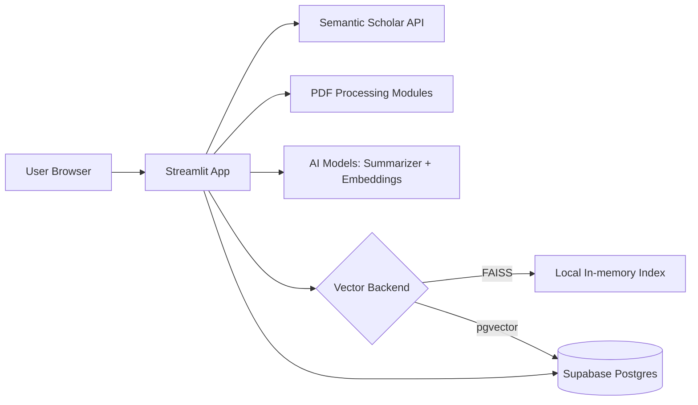
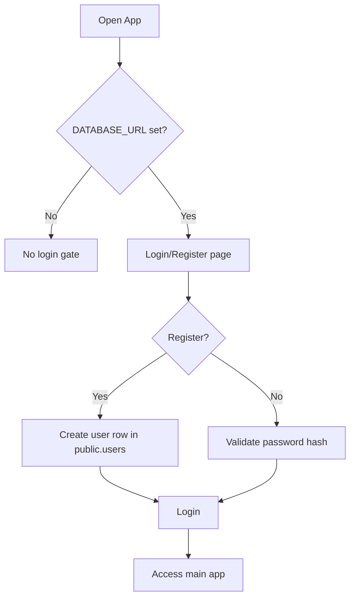
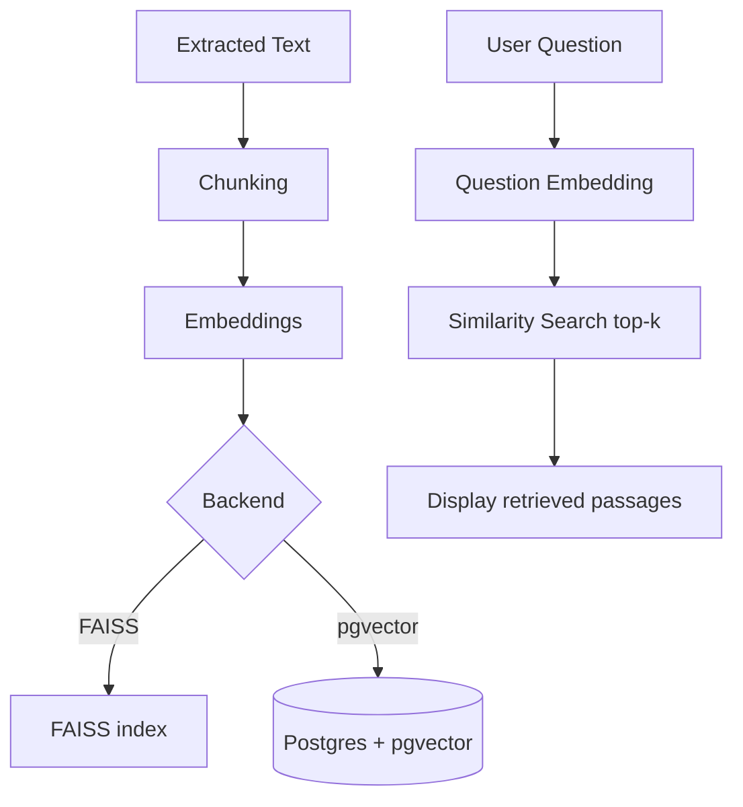

# AI Research Paper Assistant — Project Report

## Title Page
**Project Title:** AI Research Paper Assistant (Streamlit + Supabase)  
**Domain:** AI-assisted document understanding + research analytics  
**Deployment Model:** SaaS (Streamlit Cloud) + DBaaS (Supabase Postgres)  
**Date:** 2026  

## Abstract
The AI Research Paper Assistant is a Streamlit-based web application that automates key steps in reading and comparing research papers. Users can search papers online using the Semantic Scholar API, upload PDFs for text and table extraction, generate structured AI summaries, and conduct multi-paper analysis including comparison tables, trend charts, and research gap insights. The system optionally supports retrieval-based question answering (RAG-style retrieval) using either local FAISS indexing or persistent Postgres + pgvector storage. For deployment, the application is designed to demonstrate modern cloud concepts: the app is delivered as **SaaS**, user accounts and optional vector storage are provided via **DBaaS** (Supabase), and hosting can be done using managed platforms (**PaaS**) or on virtual machines (**IaaS**).

## 1. Introduction
Research papers are information-dense and time-consuming to analyze, especially when comparing multiple works across methods, datasets, and conclusions. This project addresses that challenge by providing an end-user web interface that automates document ingestion and produces structured outputs that are easier to skim, compare, and visualize.

**Key idea:** Convert unstructured PDF content into structured summaries + comparable representations, and provide a retrieval layer to quickly locate relevant passages.

## 2. Problem Statement
Researchers and students often face the following issues:
- Time required to extract key sections (problem, methodology, results, conclusion)
- Difficulty comparing multiple papers consistently
- Lack of fast “question answering” style access to long PDFs
- Manual creation of tables/graphs from paper data

**Goal:** Provide a single application that supports (a) paper discovery, (b) paper ingestion, (c) structured summarization, (d) multi-paper comparative analytics, and (e) retrieval-based exploration.

## 3. Objectives
- **O1:** Search papers online and show essential metadata (title, authors, year, citations, link).
- **O2:** Accept PDF uploads and extract:
  - plain text content
  - tabular data (when present)
- **O3:** Generate structured summaries (Problem / Methodology / Results / Conclusion).
- **O4:** Support multi-paper workflows: combined summary, comparison, trend charts, gap detection.
- **O5:** Provide a retrieval layer (RAG-style retrieval) to return top-matching document chunks for a user query.
- **O6:** Support cloud-ready deployment and demonstrate SaaS/DBaaS/PaaS/IaaS concepts.

## 4. Scope
### In scope
- Streamlit UI workflows for search, upload, viewing, and multi-paper analysis
- Optional Postgres-backed authentication (register/login) stored in `public.users`
- Optional Postgres + pgvector vector store for persistent retrieval
- Deployment readiness: Dockerfile, Streamlit secrets compatibility

### Out of scope (current)
- Full LLM-based answer generation using retrieved context (current “Ask (RAG)” returns retrieved passages)
- Fine-grained user roles/permissions and admin tools
- Comprehensive monitoring/observability and production hardening (rate-limit handling, quotas, audit logs)

## 5. System Architecture
### 5.1 High-Level Architecture
- **Client:** Web browser
- **App server:** Streamlit Python runtime
- **External service:** Semantic Scholar API
- **DBaaS:** Supabase Postgres (users; optional vector chunks)
- **Optional vector backends:**
  - FAISS (local, in-memory)
  - Postgres + pgvector (persistent)

### 5.2 Architecture Diagram (Flow)

## 6. Methodology (Functional Pipeline)
### 6.1 Authentication Methodology (DB-backed)
**Trigger:** Auth gate is enabled when `DATABASE_URL` is configured and `SKIP_AUTH` is not enabled.  
**Storage:** `public.users` table in Postgres (email unique, hashed password).

### 6.2 Research Paper Search Methodology (Semantic Scholar)
1. User enters a topic/query
2. App calls Semantic Scholar `paper/search`
3. Results are normalized into a DataFrame
4. UI presents Title/Authors/Year/Citations/URL

**Operational note:** On shared cloud IPs, requests can be rate-limited (HTTP 429). Using `SEMANTICSCHOLAR_API_KEY` improves reliability.

### 6.3 PDF Ingestion & Extraction Methodology
1. PDF uploaded via Streamlit uploader
2. File saved to local storage (`data/papers`)
3. Text extraction is performed
4. Table extraction is performed (when possible)
5. Derived visualizations can be generated from extracted tables

### 6.4 Summarization Methodology
- Extracted text is passed to an AI summarization pipeline.
- Output is presented in structured fields:
  - Problem
  - Methodology
  - Results
  - Conclusion

### 6.5 Retrieval (RAG-style Retrieval) Methodology
**Chunking + Embedding + Retrieval**
1. Split paper text into overlapping chunks
2. Generate embeddings using SentenceTransformers
3. Store/index embeddings:
   - **FAISS** (default): in-memory search
   - **pgvector**: persist chunks and embeddings in Postgres
4. Embed user question
5. Perform similarity search for top-k chunks
6. Return retrieved text passages (baseline retrieval)

### 6.6 Multi-Paper Research Workspace Methodology
1. Upload current paper + up to 5 supporting papers
2. Extract text for each
3. Run paper analysis to structure information
4. Generate:
   - combined per-paper summaries + overall summary
   - comparison table
   - trend charts
   - gap analysis themes
   - current paper contribution analysis

## 7. Technology Stack
### 7.1 Core Stack
- **Language:** Python
- **UI:** Streamlit
- **Data:** Pandas
- **Visuals:** Plotly, Matplotlib
- **HTTP:** Requests

### 7.2 PDF & Table Processing
- **Text extraction:** PyMuPDF, pdfplumber
- **Table extraction:** camelot-py

### 7.3 AI / NLP
- **Embeddings:** sentence-transformers (`all-MiniLM-L6-v2`)
- **ML runtime:** torch, transformers

### 7.4 Database & Auth
- **DB:** Postgres (Supabase recommended)
- **ORM:** SQLAlchemy
- **Password hashing:** Werkzeug

### 7.5 Retrieval / Vector Store
- **FAISS** (local)
- **pgvector** (Postgres extension) for persistent vector storage

### 7.6 Deployment
- **Streamlit Community Cloud** (PaaS-like host for Streamlit apps)
- **Dockerfile / docker-compose** for containerized deploys

## 8. Data Design
### 8.1 `public.users`
- `id` (PK)
- `email` (unique)
- `password_hash`
- `created_at`

### 8.2 `public.rag_chunks` (when using pgvector)
- `document_id`
- `chunk_index`
- `chunk_text`
- `embedding` (vector)

## 9. Cloud Service Model Mapping (IaaS / PaaS / DBaaS / SaaS)
- **SaaS:** The Streamlit web app delivered to end users via a hosted URL.
- **DBaaS:** Supabase-managed Postgres storing:
  - `public.users` (login/register)
  - optionally `rag_chunks` embeddings (pgvector)
- **PaaS:** Streamlit Cloud (or Render/Fly/Cloud Run) runs the application without server management.
- **IaaS:** Running the same container/app on a VM (EC2/Azure VM/GCE) where you manage OS/networking and process lifecycle.

## 10. Security Considerations
- **Passwords are not stored in plain text**: only hashed password values are stored.
- **Secrets management:** `DATABASE_URL` and API keys must be stored in:
  - Streamlit Cloud “Secrets” (TOML), or
  - environment variables, or
  - local `.env` (never committed)
- **Credential rotation:** If any DB password is exposed, rotate it in Supabase immediately.

## 11. Limitations and Future Enhancements
### Current limitations
- Retrieval tab returns **retrieved passages**, not a full LLM-generated answer.
- External API rate limits can affect paper search (mitigated by API key).
- Large ML dependencies may stress free-tier compute/memory.

### Future enhancements
- Add LLM answer generation using retrieved context (true RAG QA)
- Per-user document libraries (store uploaded paper metadata by user)
- Better chunk metadata (page numbers, section titles)
- More robust production readiness (logging, monitoring, retries, caching)

## 12. Conclusion
This project provides an integrated workflow for research paper discovery, ingestion, summarization, and comparative analysis through an accessible Streamlit UI. It supports a scalable deployment model using Supabase as DBaaS and Streamlit Cloud as a PaaS-style host, aligning well with cloud computing concepts (SaaS/DBaaS/PaaS/IaaS). The system establishes a strong baseline for AI-assisted research workflows and can be extended into a complete RAG question-answering assistant and a persistent research management platform.

